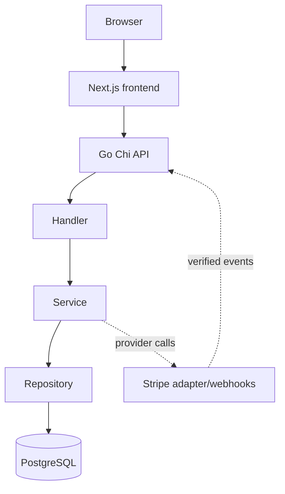

# Smart allocation

Automatic orders use a pure allocator behind the order service. The database
repository owns tenant-scoped candidate discovery, deterministic inventory
locking, effective availability, pricing snapshots, and atomic reservations.
See [allocation.md](allocation.md) for the strategy and concurrency contract.

# FlowCart OS Architecture

## Warehouse Transfers

Warehouse transfers are transactional aggregates. Dispatch locks all source and destination inventory rows in globally sorted UUID order, deducts source stock, and records `transfer_out` movements. Receipt adds destination stock and records `transfer_in` movements. In-transit quantities are derived from transfer items rather than a second mutable stock balance.

## Current Architecture

The browser talks to the Go API at `http://localhost:8081`. The frontend runs
at `http://localhost:3000` and gets the API base URL from
`NEXT_PUBLIC_API_URL`.

The Go API creates a PostgreSQL pool at startup and refuses to start if the
connection cannot be established. The health endpoint pings the database.

Authentication is separated into handler, service, repository, password, token,
and middleware responsibilities. Organization functionality has its own
handler, service, repository, tenant middleware, and authorization helpers.
Products and warehouses are separate tenant-owned modules following the same
handler -> service -> repository -> PostgreSQL flow. Inventory follows the same
flow and uses a shared inventory-row transaction for stock adjustments and
reservations. Orders use one transaction for the order, item snapshots, and
linked reservations. Payment attempts use tenant-safe snapshots and provider
calls outside database locks. Fulfillment uses sorted inventory locks, then the
order, then sorted reservations to deduct physical stock, consume committed
reservations, update order state, and append movement history atomically.
Authentication proves identity; organization membership proves tenant access.

## Authentication Flow

Register and login hash passwords with Argon2id, create a short-lived HS256 JWT
access token, create a refresh session, and set the opaque refresh token in an
HttpOnly cookie. Refresh hashes the cookie value, rotates the session
transactionally, revokes the old session, and sends a replacement cookie.
`/me` validates the Bearer JWT through middleware and loads the current user.

## Database and Migrations

PostgreSQL Docker uses host port `5433` mapped to container port `5432`. The
existing local PostgreSQL installation on port `5432` is not modified.

Versioned SQL migrations use `github.com/golang-migrate/migrate/v4` and are run
explicitly through `apps/api/cmd/migrate`. The current schema reaches
`000015` and includes orders, pricing snapshots, payments, trusted provider
events, fulfillment, allocation metadata, transfers, replenishment policies,
append-only audit events, and refresh-session families in addition to the core
SaaS tables.
`schema_migrations` is migration-tool metadata, not a domain table.

The authentication migration adds a case-insensitive unique index on
`LOWER(users.email)`, `users.password_hash`, and refresh-session persistence.
The `pgcrypto` extension provides `gen_random_uuid()` defaults.

## Organization Authorization

Organization routes use the authenticated user ID and route organization ID to
look up membership in PostgreSQL. The verified organization ID, user ID, and
role are stored in request context. Organization-specific repository queries
are scoped by organization ID.

Members can view their organization and member list. Owners and admins can
update organizations and manage members. Only owners can assign or manage
owners; admins cannot modify owners. Last-owner changes are protected with
transactional row locking.

## Deliberately Deferred

Email verification, password reset, MFA, Redis, workers, real-time updates,
analytics infrastructure, and public deployment are not implemented.
